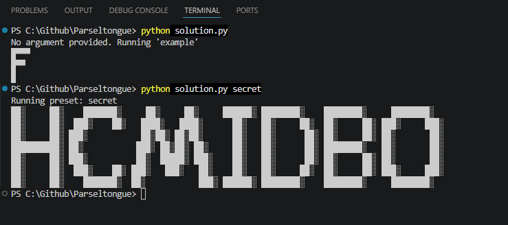
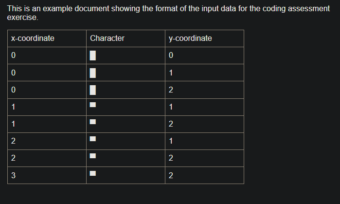

# Parseltongue
A small Python solution for a coding exercise that accepts a published Google doc URL, then parses Unicode characters and their coordinates from the document and prints them into a 2D grid to reveal a secret message.

## How It Works
1. Downloads the published Google Doc page.
2. Strips the HTML down into readable text lines.
3. Parses the text into x-coordinate, character, and y-coordinate entries.
4. Builds a character grid and prints the decoded message in the terminal.

## How to Use
To run with your own published Google Doc URL:

```bash
python solution.py "https://docs.google.com/document/d/e/....../pub"
```
To run using one of the built-in preset URLs:
```bash
python solution.py example
python solution.py secret
```
Example terminal output:

Example Google doc input format:


